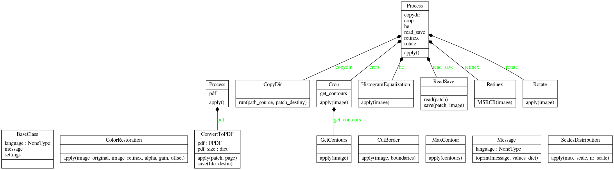
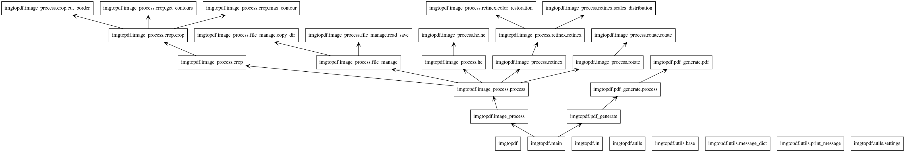

# Gerar arquivo pdf a partir de várias imagens
#_Generate pdf file from multiple images_

Repositório com scripts para tratar imagens em determinada pasta, e transformá-las em um único arquivo com extensão pdf.
_Scripted repository to process images in a given folder, and transform them into a single file with a pdf extension._


## Configurações
##_Setup_

Python versão 3.7.1
_Python version 3.7.1_

### Instalar dependências
###_Install dependencies_

Clone o repositório git e instale os requerimentos:
_Clone the git repository and install the requirements:_

```
git clone https://github.com/Lisliane/transform_images_into_single_pdf
cd transform_images_into_single_pdf
virtualenv -p python3 env
source env/bin/activate
pip install -r requeriments.txt
```

### Imagens que serão transformadas
###_Images to be transformed_

Acrescente as imagens que serão transformadas em PDF na pasta:
_Add the images to be converted to PDF in the folder:_

```
imgtopdf/in
```

**Dica:**
**_Tip:_**
Caso não sejam .PNG, mude o valor da variável EXTENSION_TO_EDIT em:
*If they are not .PNG, change the value of the EXTENSION_TO_EDIT variable to:*

```
imgtopdf/utils/settings.py
```


## Como utilizar
##_How to use_

Para executar:
_To execute:_

```
cd imgtopdf/
./main.py --option=1 --lang=PTB
```

Onde:
_Where:_

--option: 1-Trata imagens e gera PDF   2-Apenas gera PDF
_--option: 1-Treats images and generate PDF   2-Generates PDF only_

--lang: Define idioma. Opções: PTB (português)  ENG (inglês)
_--lang: Defines language. Options: PTB (portuguese)  ENG (english)_


Para alterar as constantes, edite o arquivo:
_To change the constants, edit the file:_

```
imgtopdf/utils/settings.py
```

## Resultado
##_Result_

O arquivo final estará na pasta:
_The final file will be in the folder:_

```
imgtopdf/out/result
```

**Dica:**
**_Tip:_**

* Caso deseja mudar o nome do arquivo final .PDF, mude o valor da variável DESTINY_PDF.
* *If you want to change the name of the final .PDF file, change the value of the DESTINY_PDF variable.*

* Caso deseja mudar as margens, mude o valor das variáveis PDF_X e PDF_Y.
* *If you want to change the margins, change the value of the variables PDF_X and PDF_Y.*

```
imgtopdf/utils/constant.py
```


## Estrutura das pastas
##_Folders structure_

As pastas foram organizadas da seguinte forma:
_The folders were organized as follows:_

* imgtopdf: pasta principal da solução, contendo o arquivo main.py, que executa.
* *imgtopdf: main folder of the solution, containing the main.py file, which is executed.*

* imgtopdf/in: onde as imagens originais devem ser colocadas. A partir desta pasta, as imagens são tratadas e consequentemente, geram o arquivo final.
* *imgtopdf/in: where the original images are to be placed. From this folder, the images are processed and, consequently, generate the final file.*

* imgtopdf/out/edited: onde as imagens são trabalhadas.
* *imgtopdf/out/edited: where the images are worked.*

* imgtopdf/out/result: pasta com o arquivo pdf gerado.
* *imgtopdf/out/result: folder with the generated pdf file.*

* imgtopdf/image_process: classes que processam as imagens, subdivido em:
* *imgtopdf/image_process: classes that process the images, subdivided into:*

* imgtopdf/image_process/crop: corta as margens externas da imagem.
* *imgtopdf/image_process/crop: crop the outer edges of the image.*

* imgtopdf/image_process/file_manage: copia, leitura e gravação de imagens.
* *imgtopdf/image_process/file_manage: copy, read and write images.*

* imgtopdf/image_process/he: equalização de histograma.
* *imgtopdf/image_process/he: histogram equalization.*

* imgtopdf/image_process/retinex: aplicação de retinex na imagem.
* *imgtopdf/image_process/retinex: retinex application on the image.*

* imgtopdf/image_process/rotate: auto rotação da imagem.
* *imgtopdf/image_process/rotate: auto image rotation.*

* imgtopdf/pdf_generate: classes que criam o arquivo PDF.
* *imgtopdf/pdf_generate: classes that create the PDF file.*

* imgtopdf/utils: classes comuns entre as funcionalidades.
* *imgtopdf/utils: common classes between features.*


## Resultado pyreverse
##_Result pyreverse_

```
pyreverse imgtopdf -o project.png
```
### Classes
###_Class_


### Pacotes
###_Packages_



## Autora
##_Author_

Lisliane Zanette de Oliveira (lislianezanetteoliveira@gmail.com)
